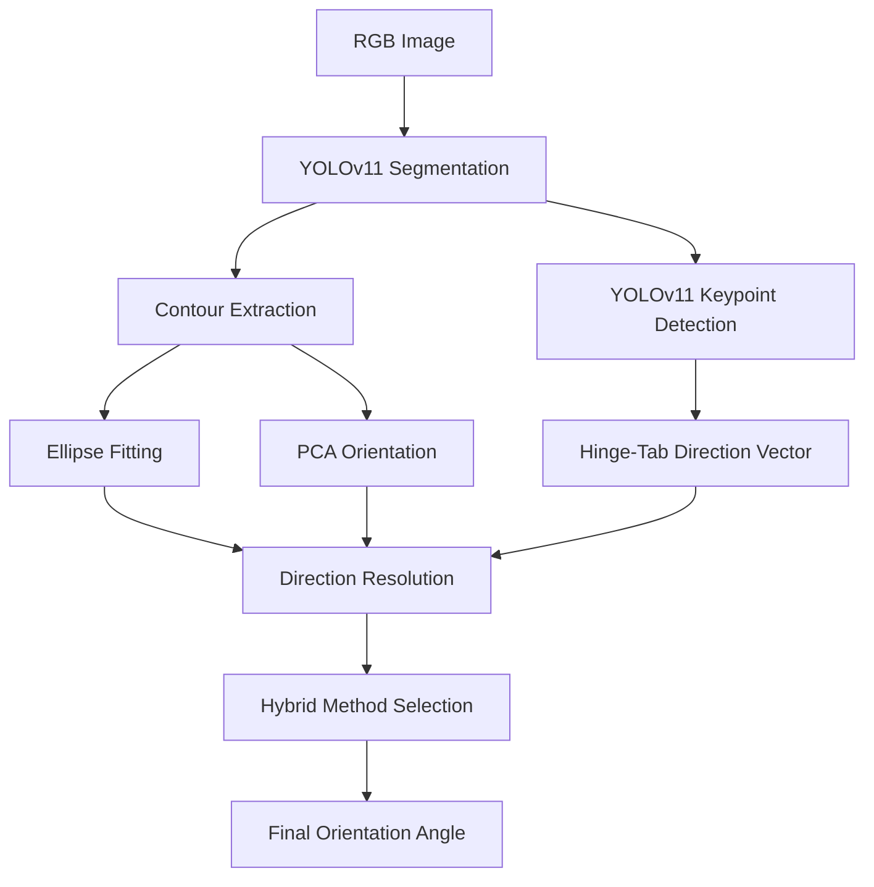
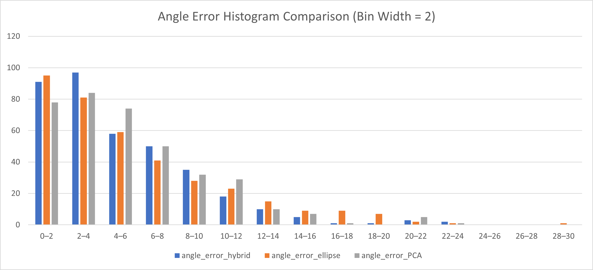
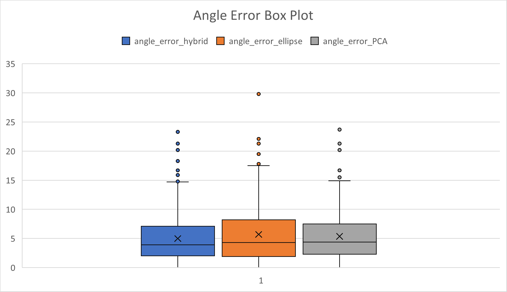
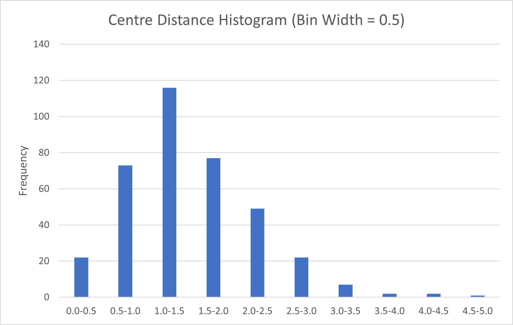

# Hybrid Lid Orientation Estimation Pipeline
Hybrid computer vision pipeline for lid orientation estimation using segmentation, PCA, ellipse fitting, and keypoint-guided direction resolution. Zeon Assignment 1 submission by Jaywardhan Raghu (23B0737).

## Problem Statement

The objective of this assignment is to estimate the orientation angle of circular lids from RGB images.

Given an input image containing one or more lids, the system should:
- detect each lid
- estimate its center coordinates
- predict its orientation angle

The solution should generalize across varying lid positions, rotations, and image conditions.

## Methodology

### 1. Segmentation
A YOLOv11 segmentation model was used to detect individual lids and generate pixel-level contours for each object.

### 2. Contour Extraction
Contours were extracted from segmentation masks and used as the geometric basis for orientation estimation.

### 3. Ellipse-Based Orientation
An ellipse was fit to each contour to estimate the dominant geometric axis of the lid.

### 4. PCA-Based Orientation
Principal Component Analysis (PCA) was applied to contour points to estimate the primary direction of elongation.

### 5. Keypoint Detection
A separate YOLOv11 keypoint model was trained to detect hinge and tab locations for directional disambiguation.

### 6. Direction Resolution
Keypoint vectors were used to resolve the 180° ambiguity inherent in ellipse and PCA major-axis estimation.

### 7. Hybrid Arbitration
The final pipeline dynamically selected between ellipse and PCA orientation estimates based on geometric disagreement between the two methods.

## Pipeline Overview



## Example Predictions

Below are sample outputs from the final hybrid orientation estimation pipeline.

The green contour represents the segmented lid boundary, while the red arrow indicates the predicted orientation direction and the yellow text shows the estimated angle.

| Original Image | Overlay Prediction |
|---|---|
|  |  |

## Evaluation Methodology

Predicted lids were matched to ground-truth annotations using nearest-neighbor spatial matching based on lid center coordinates.

Angular error was computed using circular angular difference:

error = min(|a - b|, 360 - |a - b|)

where:
- a = predicted angle
- b = ground-truth angle

## Final Results

Evaluation was performed on:
- 70 images
- 371 lids

### Final Hybrid Method Performance

| Metric | Value |
|---|---|
| Mean Angular Error | 4.98° |
| Median Angular Error | 4.0° |
| Max Angular Error | 23.25° |
| Mean Center Distance | 1.50 px |
| Median Center Distance | 1.39 px |

## Comparison of Orientation Estimation Methods

| Method | Mean Error | Median Error | Max Error |
|---|---|---|---|
| Ellipse Fitting | 5.7° | 4.3° | 29.8° |
| PCA Orientation | 5.36° | 4.4° | 23.25° |
| True Hybrid Method | 4.98° | 4.0° | 23.25° |
| Center Distance | 1.5px | 1.39px | 4.76px |

## Error Distribution

### Angular Error Histogram



### Angular Error Box Plot



### Center Distance Distribution



## Repository Structure

```text
├── notebooks/
│   ├── experimentation.ipynb
│   └── Final_Method_Demo.ipynb
│
├── images/
│   ├── originals/
│   │   └── original input images
│   │
│   └── overlays/
│       └── final overlay predictions
│
├── results/
│   ├── final_true_hybrid_predictions.csv
│   └── Model_Comparison.csv
│
├── plots/
│   ├── angular_error_histogram.png
│   ├── angular_error_boxplot.png
│   └── center_error_histogram.png
│
├── README.md
└── requirements.txt
```

## Setup

Install dependencies:

```bash
pip install -r requirements.txt
```

This project uses Roboflow-hosted inference APIs.

To run the notebook:
1. Create a Roboflow account
2. Obtain an API key
3. Replace:

```python
API_KEY = "vof93SgrEEFl6QUIp6BI"
```

inside the notebook.

## Future Improvements

- improve contour precision
- reduce inference nondeterminism
- export models for local inference
- train on larger annotated datasets
- improve robustness to highly circular contours
- incorporate temporal smoothing for video sequences
