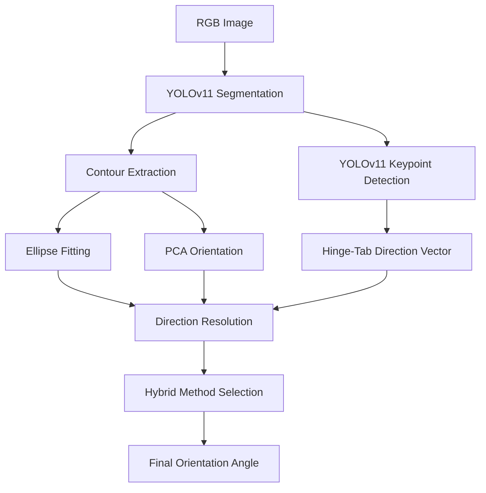
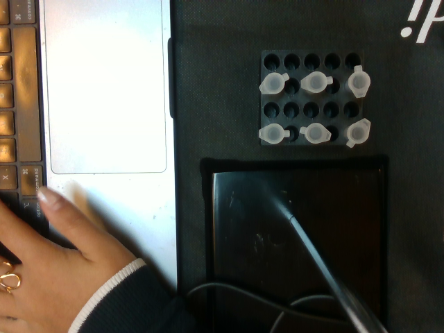
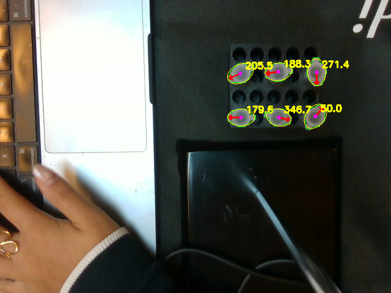
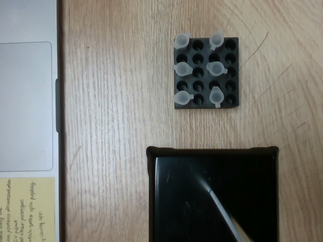
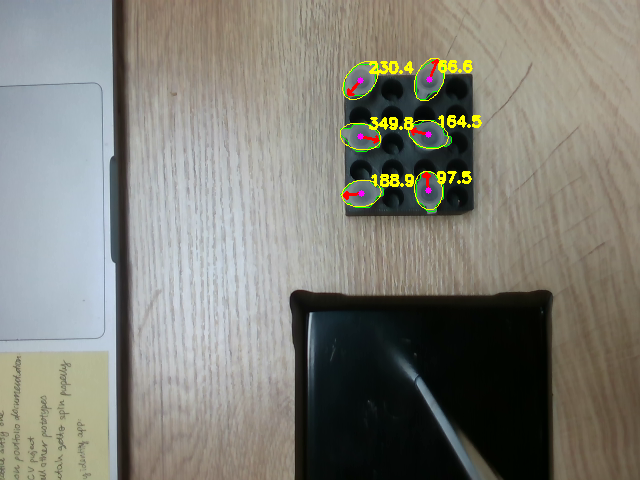
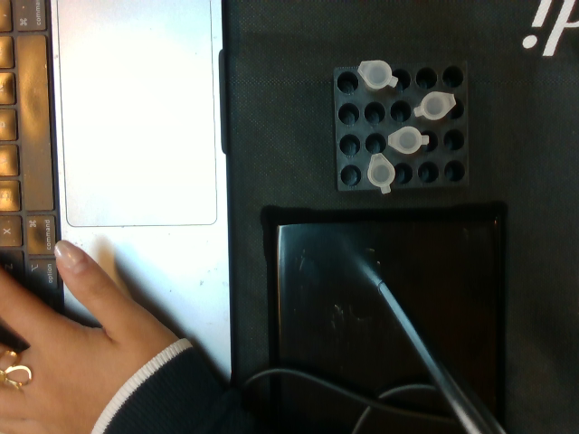
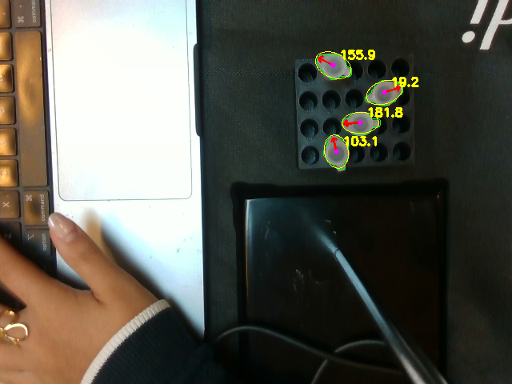
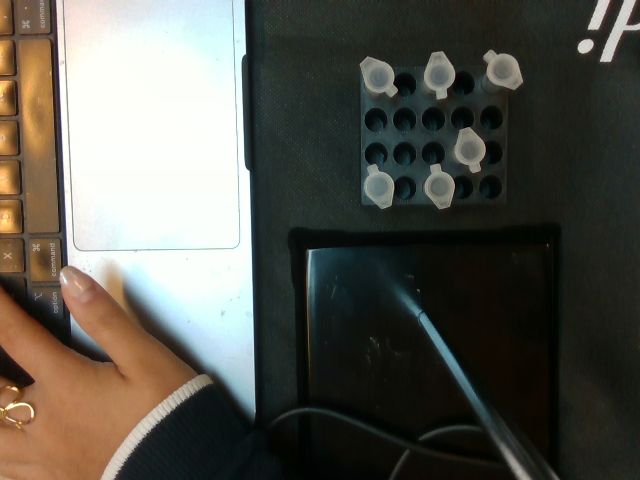
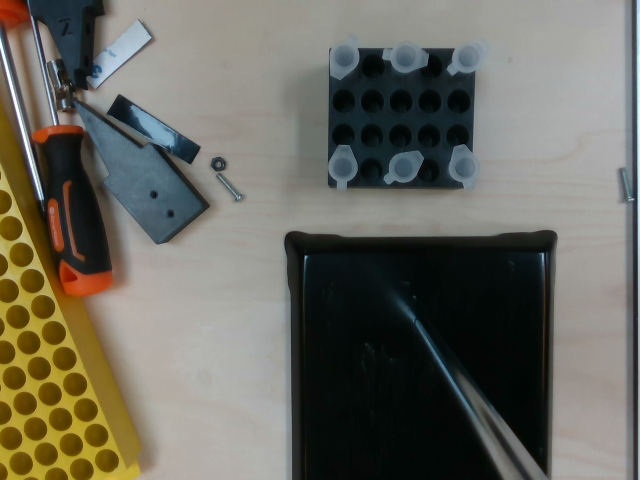
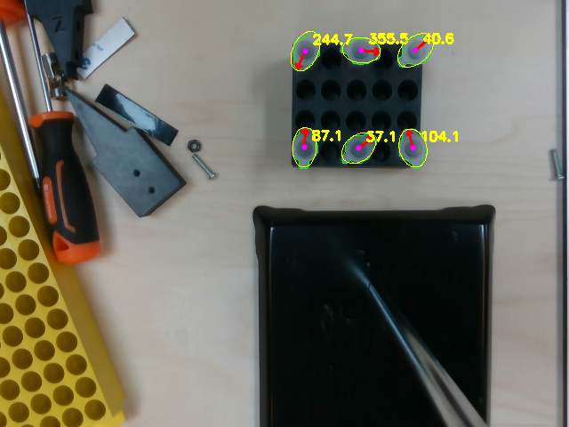

# Hybrid Lid Orientation Estimation Pipeline
Hybrid computer vision pipeline for lid orientation estimation using segmentation, PCA, ellipse fitting, and keypoint-guided direction resolution. Zeon Assignment 1 submission by Jaywardhan Raghu (23B0737).

## Problem Statement

The objective of this assignment is to estimate the orientation angle of circular lids from RGB images.

Given an input image containing one or more lids, the system should:
- detect each lid
- estimate its center coordinates
- predict its orientation angle

The system should generalize across varying lid positions, rotations, and image conditions.

## Methodology

### 1. Segmentation
A YOLOv11 segmentation model was used to detect individual lids and generate pixel-level contours for each object.

### 2. Contour Extraction
Contours were extracted from segmentation masks and used as the geometric basis for orientation estimation.

### 3. Ellipse-Based Orientation
An ellipse was fit to each contour to estimate the dominant geometric axis of the lid.

### 4. PCA-Based Orientation
Principal Component Analysis (PCA) was applied to contour points to estimate the primary direction of elongation.

### 5. Keypoint Detection
A separate YOLOv11 keypoint model was trained to detect hinge and tab locations for directional disambiguation.

### 6. Direction Resolution
Keypoint vectors were used to resolve the 180° ambiguity inherent in ellipse and PCA major-axis estimation.

### 7. Hybrid Method Selection
The pipeline dynamically switches between orientation estimators based on geometric consensus to leverage the unique strengths of each mathematical approach:
- **Ellipse Fitting (High-Precision / Low-Robustness):** Highly accurate for clean, perfectly segmented contours—driving down errors into the absolute minimum bins (0° to 4°), but highly susceptible to minor contour noise, which can cause large localized failures (Max Error: 29.8°).
- **PCA Orientation (High-Robustness / Moderate-Precision):** Highly consistent across all samples by capturing global shape trends, tightly bounding errors within a reliable < 10° window, but less capable of micro-accuracy under 2°.

**Selection Rule:** If the absolute angular delta between the Ellipse and PCA estimates is within a tightly bound consensus threshold ($\le 10^{\circ}$), the contour is considered structurally clean, and the high-precision **Ellipse method** is prioritized. If the disagreement exceeds 10°, it signifies a degraded, asymmetrical, or noisy contour; the pipeline then defaults to the stable **PCA method**, capping the system's outlier risk.

If the disagreement exceeds $10^{\circ}$, it signifies a degraded or asymmetrical contour where Ellipse fitting breaks down. In these high-disagreement cases, the pipeline falls back to the more reliable **PCA method**, effectively capping the system's maximum outlier error at $23.25^{\circ}$ instead of allowing it to drift to $29.8^{\circ}$.

## Model Training

Two YOLOv11 models were trained using Roboflow:

- a segmentation model for lid extraction
- a keypoint detection model for hinge and tab localization

The trained models were used as inputs to the downstream geometric orientation estimation pipeline.

## Model Validation Metrics

The YOLOv11 models achieved strong validation performance during training on Roboflow.

### Segmentation Model

| Metric | Value |
|---|---|
| mAP@50 | 99.5% |
| Precision | 99.7% |
| Recall | 100% |
| F1 Score | 99.8% |

### Keypoint Detection Model

| Metric | Value |
|---|---|
| mAP@50 | 99.5% |
| Precision | 100% |
| Recall | 100% |
| F1 Score | 100% |

## Pipeline Overview



## Example Predictions

Below are sample outputs from the final hybrid orientation estimation pipeline.

The green contour represents the segmented lid boundary, while the red arrow indicates the predicted orientation direction and the yellow text shows the estimated angle.

| Original Image | Overlay Prediction |
|---|---|
|  |  |
|  |  |
|  |  |
|  |  |
|  |  |

## Evaluation Methodology

Predicted lids were matched to ground-truth annotations using nearest-neighbor spatial matching based on lid center coordinates.

Angular error was computed using circular angular difference:

error = min(|a - b|, 360 - |a - b|)

where:
- a = predicted angle
- b = ground-truth angle

## Detection Performance

Detection performance was evaluated using one-to-one spatial matching between predicted lid centers and ground-truth annotations.

All 371 ground-truth lids were successfully detected without unmatched predictions.

| Metric | Value |
|---|---|
| Precision | 1.00 |
| Recall | 1.00 |
| F1 Score | 1.00 |
| Total Ground Truth Lids | 371 |
| Total Predicted Lids | 371 |
| Matched Lids | 371 |

## Pipeline Performance

Evaluation was performed on:
- 70 images
- 371 lids

### Final Hybrid Method Performance

| Metric | Value |
|---|---|
| Mean Angular Error | 4.98° |
| Median Angular Error | 4.0° |
| Max Angular Error | 23.25° |
| Mean Center Distance | 1.50 px |
| Median Center Distance | 1.39 px |
| Max Center Distance | 4.76 px |

## Comparison of Orientation Estimation Methods

| Method | Mean Error | Median Error | Max Error |
|---|---|---|---|
| Ellipse Fitting | 5.7° | 4.3° | 29.8° |
| PCA Orientation | 5.36° | 4.4° | 23.25° |
| True Hybrid Method | 4.98° | 4.0° | 23.25° |

## Error Distribution

### Angular Error Histogram


### Angular Error Box Plot


### Center Distance Distribution


## Results Analysis

The hybrid pipeline achieved a mean angular error of 4.98° and median of 4.0° across 371 lids, outperforming both standalone methods.

Key observations:

- The hybrid IQR is tighter than both standalone methods, meaning the pipeline is more consistent through the middle of the distribution, not just better at the extremes — this is the direct effect of the consensus-based selection rule routing noisy contours to PCA and clean contours to ellipse fitting.
- The error tail from 10°–23° decays gradually with no secondary cluster, which confirms the 180° ambiguity resolution is working correctly on every prediction — a keypoint failure would produce a second peak near 90° or 180°, which is absent.
- The remaining ~10.8% of high-error predictions are most likely lids with nearly circular contours, where eccentricity approaches zero and both ellipse and PCA lose sensitivity to the true major axis — small segmentation noise then rotates the estimate significantly. This is a fundamental geometric limitation, not a pipeline failure.
- Centre distance histogram peaks at 1.0–1.5px rather than 0–0.5px, suggesting a small systematic offset from mask boundary quantization at 640×480 resolution — practically negligible at 1.50px mean but worth addressing for higher-precision applications.

For production-grade deployment with tight mechanical tolerances, the primary improvement needed is better contour precision on near-circular lids, either through higher-resolution segmentation or an additional circularity check that flags low-confidence predictions before they reach the orientation estimator.

## Repository Structure

```text
├── notebooks/
│   ├── experimentation.ipynb
│   └── Final_Method_Demo.ipynb
│
├── images/
│   ├── originals/
│   │   └── original input images
│   │
│   └── overlays/
│       └── final overlay predictions
│
├── results/
│   ├── final_true_hybrid_predictions.csv
│   └── Model_Comparison.csv
│
├── plots/
│   ├── angular_error_histogram.png
│   ├── angular_error_boxplot.png
│   └── center_error_histogram.png
│
├── main.py
├── README.md
└── requirements.txt
```

## Setup & Evaluation Guide

This repository is optimized for rapid evaluation. You can verify the pipeline end-to-end either locally via the Command-Line Interface (CLI) or interactively within a cloud runtime environment.

## Quick Run

Install dependencies:

```bash
pip install -r requirements.txt
```

Run inference on an image:

```bash
python main.py --image path/to/image.png
```

Example:

```bash
python main.py --image images/originals/6f323235-color.png
```

The pipeline will:
- detect lids
- estimate orientations
- generate overlay visualization
- save output image locally

## Use of AI Tools

AI-assisted development tools were used during experimentation and debugging.

Roboflow was used for:
- dataset annotation and management
- YOLOv11 model training
- hosted inference APIs

Large language models were additionally used to:
- assist with debugging
- refine evaluation pipelines

All final implementation decisions, evaluation methodology, and analysis were independently verified and validated.

## Future Improvements

- improve contour precision
- improve consistency across repeated inference runs
- export models for local inference
- train on larger annotated datasets
- improve robustness to highly circular contours
- incorporate temporal smoothing for video sequences
