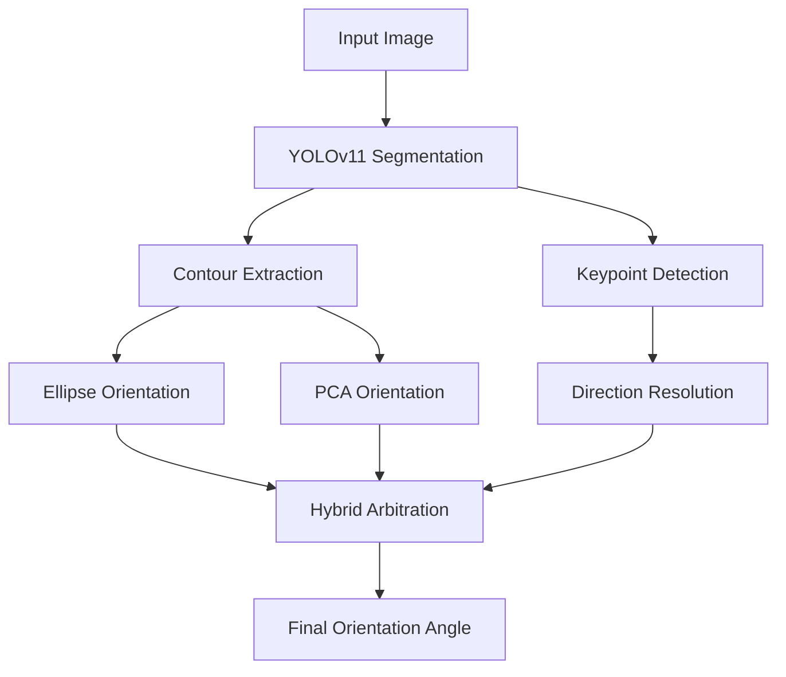

# Hybrid Lid Orientation Estimation Pipeline
Hybrid computer vision pipeline for lid orientation estimation using segmentation, PCA, ellipse fitting, and keypoint-guided direction resolution. Zeon Assignment 1 submission by Jaywardhan Raghu (23B0737).

## Problem Statement

The objective of this assignment is to estimate the orientation angle of circular lids from RGB images.

Given an input image containing one or more lids, the system should:
- detect each lid
- estimate its center coordinates
- predict its orientation angle

The solution should generalize across varying lid positions, rotations, and image conditions.

## Methodology

### 1. Segmentation
A YOLOv11 segmentation model was used to detect individual lids and generate pixel-level contours for each object.

### 2. Contour Extraction
Contours were extracted from segmentation masks and used as the geometric basis for orientation estimation.

### 3. Ellipse-Based Orientation
An ellipse was fit to each contour to estimate the dominant geometric axis of the lid.

### 4. PCA-Based Orientation
Principal Component Analysis (PCA) was applied to contour points to estimate the primary direction of elongation.

### 5. Keypoint Detection
A separate YOLOv11 keypoint model was trained to detect hinge and tab locations for directional disambiguation.

### 6. Direction Resolution
Keypoint vectors were used to resolve the 180° ambiguity inherent in ellipse and PCA major-axis estimation.

### 7. Hybrid Arbitration
The final pipeline dynamically selected between ellipse and PCA orientation estimates based on geometric disagreement between the two methods.

## Pipeline Overview

